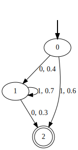
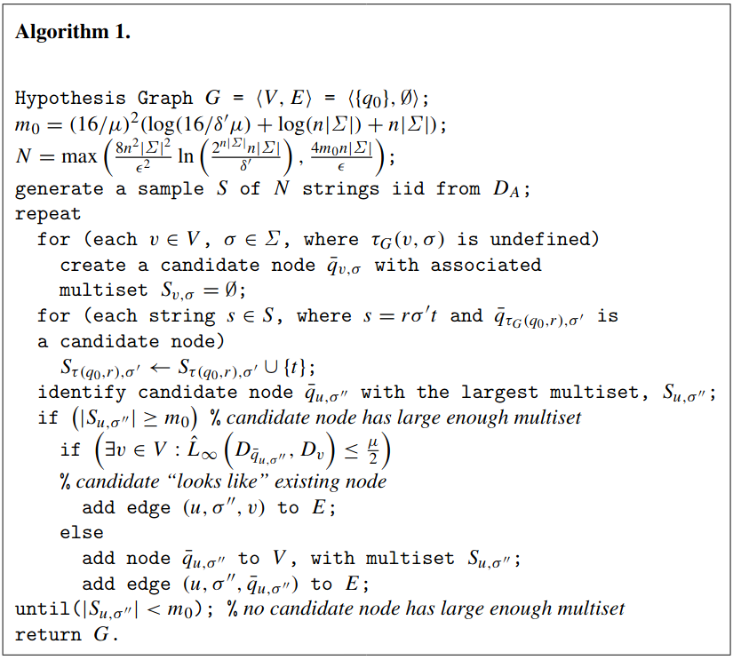
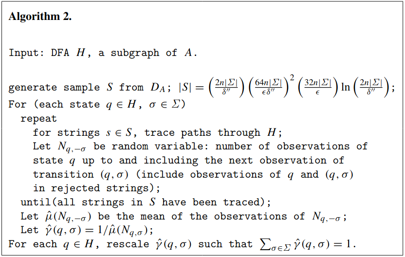

These days I've been working on a problem that required the learning
of a Probabilistic Deterministic Automata (PDFA) <d-cite key="pdfa63"></d-cite>.
In particular, the learning algorithm we are using
provides guarantees on the total variation distance between
the ground truth automaton $\mathcal{A}$ and the learned automaton $\mathcal{A}^\prime$ <d-cite key="palmer2005"></d-cite>.
In the following, I will provide more background definitions and details on my implementation of the algorithm.

## PDFA

A _Probabilistic Deterministic Finite Automaton_ <d-cite key="pdfa63"></d-cite> $\mathcal{A}$ is 
a tuple $\langle Q, \Sigma, q_0, q_f, \tau, \gamma \rangle$ where:

- $Q$ is the set of states.
- $\Sigma$ is the alphabet.
- $q_0 \in Q$ is the initial state.
- $q_f \not\in Q$ is the final state.
- $\tau: Q \times \Sigma \to Q$ is the transition function.
- $\gamma: Q \times \Sigma \to [0, 1]$ is a function that associates a transition 
  $(q, \sigma)$ to the probability that that transition can be taken.

Other requirements for a valid PDFA are:
- $\forall q.\sum_{\sigma \in \Sigma} \gamma(q, \sigma) = 1$, that is, the probabilities of the outgoing transitions from a given state $q$ must sum to $1$.
- when $\tau(q, \sigma)$ is undefined, $\gamma(q, \sigma) = 0$.
- $\forall q. \exists s\in\Sigma^*. \tau(q, s) = q_f \wedge \gamma(q, s) > 0$, i.e. $q_f$ is reachable with probability non-zero from any state.

A PDFA $\mathcal{A}$ defines a probability distribution over strings in $\Sigma^*$. Notice that 
the reachability of the final state $q_f$ ensures that any execution of $\mathcal{A}$ will halt with probability $1$.

It is useful to extend $\tau$ and $\gamma$ for succinteness purposes, i.e.:
- $\tau(q, s) = \tau(\tau(q, \sigma_1), \sigma_2...\sigma_k$
- $\gamma(q, s) = \gamma(q, \sigma_1) \cdot \gamma(\tau(q, \sigma_1), \sigma_2...\sigma_k)$

Let $D_{\mathcal{A}}(s)$ be the probability distribution over strings $\Sigma^*$. 

We have: 

$D_{\mathcal{A}}(s) = \gamma(q_0,s)$ for $s$ such that $\tau(q_0,s) = q_f$.

Moreover, we define the _variation distance_ $L_1$ between two distributions
$D_1$ and $D_2$ over $\Sigma^*$ as 
$L_1(D_1, D_2) = \sum_{s\in\Sigma^*} | D_1(s) - D_2(s) |$.

Later, it will be useful the following definition of $L_{\infty}$-norm between two distributions $D$, $D^\prime$:

$L_{\infty}(D, D^\prime) = \max_{s\in\Sigma^*} |D(s) - D^\prime(s)|$

![A Simple PDFA with $\zeta,\zeta^\prime\in [0, 1]$ ](simple-pdfa-example.jpeg) 

## PDFAs in Python

I implemented a [tiny Python library](https://github.com/marcofavorito/pdfa-learning)<d-footnote>Not meant to be production-ready :smile:</d-footnote> to handle PDFAs.
In the following code snippet, you can see the implementation of the class for representing
a PDFA.

<d-code block language="python">
"""Base module of the PDFA package."""

from dataclasses import dataclass
from typing import AbstractSet, Collection, Set, Tuple

import numpy as np

from src.helpers.base import assert_
from src.pdfa.helpers import (
    _check_ergodicity,
    _check_is_legal_character,
    _check_is_legal_state,
    _check_is_legal_word,
    _check_transitions_are_legal,
)
from src.pdfa.types import Character, State, TransitionFunctionDict, Word

@dataclass(frozen=True)
class PDFA:
    """
    Probabilistic Deterministic Finite Automaton.

    - The set of states is the set of integers {0, ..., nb_states - 1} (nb_states > 0)
    - The alphabet is the set of integers {0, ..., alphabet_size - 1}
    - The initial state is always 0
    - The final state is always "nb_states"
    - The transition function is a nested dictionary:
        - at the first level, we have states as keys and the dict of outgoing transition_dict as values
        - a dict of outgoing transition_dict has characters as keys and a tuple of next state and probability
          as value.

    At initialization times, checks on the consistency of the transition dictionary are done.
    """

    nb_states: int
    alphabet_size: int
    transition_dict: TransitionFunctionDict

    def __post_init__(self):
        """Post-initialization checks."""
        assert_(self.nb_states > 0, "Number of states must be greater than zero.")
        assert_(self.alphabet_size > 0, "Alphabet size must be greater than zero.")
        _check_transitions_are_legal(
            self.transition_dict, self.nb_states, self.alphabet_size
        )
        _check_ergodicity(self.transition_dict, self.nb_states, self.final_state)

    def get_successor(self, state: State, character: Character) -> State:
        """
        Get the successor state.

        :param state: the starting state.
        :param character: the read symbol.
        :return: the new state.
        """
        _check_is_legal_state(state, self.nb_states)
        _check_is_legal_character(character, self.alphabet_size)
        next_transitions = self.transition_dict.get(state, {})
        assert_(
            character in next_transitions,
            f"Cannot read character {state} from state {character}.",
        )
        next_state, _probability = next_transitions[character]
        return next_state

    def get_successors(self, state: State) -> AbstractSet[State]:
        """Get the successors."""
        _check_is_legal_state(state, self.nb_states)
        return {
            successor
            for _character, (successor, _probability) in self.transition_dict[
                state
            ].items()
        }

    def get_next_transitions(
        self, state: State
    ) -> Collection[Tuple[Character, float, State]]:
        """Get next transitions from a state."""
        _check_is_legal_state(state, self.nb_states)
        return {
            (character, probability, successor)
            for character, (successor, probability) in self.transition_dict[
                state
            ].items()
        }

    @property
    def initial_state(self):
        """Get the initial state."""
        return 0

    @property
    def final_state(self) -> State:
        """Get the final state."""
        return self.nb_states

    @property
    def states(self) -> Set[State]:
        """Get the set of states."""
        return set(range(self.nb_states))

    @property
    def transitions(self) -> Collection[Tuple[State, Character, float, State]]:
        """Get the transitions."""
        return {
            (start, char, prob, end)
            for start, out_transitions in self.transition_dict.items()
            for char, (end, prob) in out_transitions.items()
        }

    def get_probability(self, word: Word):
        """Get the probability of a word."""
        if len(word) == 0:
            return 0.0

        _check_is_legal_word(word, self.alphabet_size)
        result = 1.0
        current_state = self.initial_state
        for character in word:
            if current_state is None or current_state == self.final_state:
                result = 0.0
                break
            next_state, probability = self.transition_dict.get(current_state, {}).get(
                character, (None, 0.0)
            )
            current_state = next_state
            result *= probability
        return 0.0 if current_state != self.final_state else result

    def sample(self) -> Word:
        """Sample a word."""
        current_state = self.initial_state
        word = []
        while current_state != self.final_state:
            characters, probabilities, next_states = zip(
                *self.get_next_transitions(current_state)
            )
            index = np.random.choice(range(len(characters)), p=probabilities)
            next_character = characters[index]
            current_state = next_states[index]
            word.append(next_character)
        return word

</d-code>

In particular:
- The set of states is the set of integers $\\{ 0, ..., nb\\_states - 1\\}$ (with $nb\\_states > 0$)
- The alphabet is the set of integers $\\{0, ..., alphabet\\_size - 1\\}$
- The initial state is always $q_0 = 0$
- The final state is always $q_f = nb\\_states$
- The transition function is a nested dictionary:
  - at the first level, we have states as keys and the dict of outgoing $transition\\_dict$ as values
  - a dict of outgoing transitions has characters $\sigma$ as keys and a tuple of next state and probability
    $(q^\prime, p)$ as value.

For example, to create an object representing the PDFA showed above (with $\zeta = 0.4$ and $\zeta^\prime = 0.7$):

<d-code block language="python">
from src.pdfa import PDFA
p1 = 0.4
p2 = 0.7
automaton = PDFA(
    nb_states=2,
    alphabet_size=2,
    transition_dict={
        0: {
            0: (1, p1),
            1: (2, 1 - p1),
        },
        1: {
            0: (2, 1 - p2),
            1: (1, p2),
        },
    },
)
</d-code>

There is a helper function to render the automaton with Graphviz:

<d-code block language="python">
from src.pdfa.render import to_graphviz
to_graphviz(automaton).render("path-to-file")
</d-code>

That results in:

## Learning a PDFA

As stated earlier, the library also implements a PDFA learning algorithm, proposed in <d-cite key="palmer2005"></d-cite>.

There exist other approaches (<d-cite key="ron1998,clark2004"></d-cite>). In <d-cite key="ron1998"></d-cite>, they show how to learn _acyclic_ PDFAs, 
and apply the algorithm to speech and handwriting recognition. In <d-cite key="clark2004"></d-cite>, 
they are able to learn general PDFAs, using an upper-bound in terms of the Kullback–Leibler divergence <d-cite key="kullback1951"></d-cite> 
between the true distribution and the learned one. The one we are going to describe learns a PDFA
whose total variation distance from the true PDFA is upper-bounded by an $\varepsilon$:

$L(D, \hat{D}) = \sum_{s\in\Sigma^*} |D(s) - \hat{D}(s)| \le \varepsilon$

All the mentioned algorithms are _Probably Approximately Correct_ for some probability $\delta$ to fail and some error
tolerance $\varepsilon$ <d-cite key="valiant1984"></d-cite>. That is, with probability $1-\delta$, 
they learn a model whose error measure is guaranteed to be upper-bounded by some quantity depending on $\varepsilon$.

An important concept in the context of the learning of a PDFA is the _distinguishability_ of
any pair of states. Formally, we say that a pair of nodes
$(q_1,q_2)$ are _$\mu$-distinguishable_ if

$L_{\infty}(D_{q_1}, D_{q_2}) = \max_{s\in\Sigma^*} |D_{q_1}(s) - D_{q_2}(s)| \ge \mu$

where $D_{q}$ is the distribution represented by the automaton starting from $q$.
The idea is that $q_1$ and $q_2$ should have sufficiently different suffix distributions 
in order to be considered separate states.

The algorithm is quite complex to be explained in detail here.
It takes in input the following parameters:
- $\Sigma$: the alphabet size.
- $n$: an upper bound on the number of states of the target automaton.
- $\mu$: a lower bound on distinguishability.

Plus the PAC parameters $\delta$ and $\varepsilon$.

It is composed in two parts:
- Estimation of a _subgraph_ $H$ of the underlying graph of a PDFA;
- Estimation of the probabilities on the edges.

Here the pseudocode of both algorithms: 

|  | 
|:--:| 
| Find a subgraph $H$ of $\mathcal{A}$ |

|  | 
|:--:| 
| Find the probabilities $\gamma(q,\sigma)$ forall $q,\sigma$ |

For both algorithms, we need to generate a certain amount of samples from the true PDFA $\mathcal{A}$.
However, despite the number of samples is polynomial 
in terms of all the parameters of the algorithm,
the amount of samples needed for the PAC guarantees is _computationally prohibitive_ 
for even reasonable assignment of such parameters.

For example, say we want to learn an automaton with $n=2$, $|\Sigma| = 2$, $\mu = 0.1$, and 
PAC parameters $\varepsilon = 0.1$ and $\delta^\prime = \delta^{\prime\prime} = 0.1$ 
($\delta^\prime$ is the probability of failure of Algorithm 1, whereas 
 $\delta^{\prime\prime}$ is the probability of failure of Algorithm 2. They are
 such that $\delta^\prime + \delta^{\prime\prime} = \delta$).

The following code snippet compute the number of samples for Algorithm 1:

<d-code block language="python">
"""Compute sample size for Algorithm 1."""
from math import ceil, log2, log

def compute_m0(n: int, s: int, mu: float, eps: float, delta_1: float):
    return ceil((16 / mu) ** 2 * (log2(16 / delta_1 / mu) + log2(n * s) + n * s))

def sample_size_1(n: int, s: int, mu: float, eps: float, delta_1: float):
    """Compute N for Algorithm 1."""
    m0 = compute_m0(n, s, mu, eps, delta_1)
    N1 = 8 * (n ** 2) * (s ** 2) / (eps ** 2) * (log((2 ** (n * s)) * n * s / delta_1))
    N2 = 4 * m0 * n * s / eps
    N = ceil(max(N1, N2))
    return N

</d-code>

This one does the same but for Algorithm 2:
<d-code block language="python">
"""Compute sample size for Algorithm 2."""
from math import ceil, log

def sample_size_2(n: int, s: int, mu: float, eps: float, delta_2: float):
    n1 = 2 * n * s / delta_2
    n2 = (64 * n * s / eps / delta_2) ** 2
    n3 = 32 * n * s / eps
    n4 = log(2 * n * s / delta_2)
    N = ceil(n1 * n2 * n3 * n4)
    return N

</d-code>

The number of samples for Algorithm 1 is given by:

<d-code block language="python">
n = 2
s = 2
mu = 0.1
eps = 0.1
delta_1 = 0.1
N = sample_size_1(n, s, mu, eps, delta_1)
</d-code>

Where `N` is `68173280` ($\approx 68 \cdot 10^6$ number of samples).

For Algorithm 2:
<d-code block language="python">
delta_2 = 0.1
N = sample_size_2(n, s, mu, eps, delta_2)
</d-code>

The result in `N` is `294072829470708` ($\approx 3 \cdot 10^{15}$ number of samples).

As said, these numbers are not practical for any personal computer. 
However, for some examples, a much lower number of samples can be enough,
as shown in the next section.

## Implementation of the learning algorithm

In the [same repository](https://github.com/marcofavorito/pdfa-learning)
(in [src/learning-pdfas/](https://github.com/marcofavorito/pdfa-learning/tree/main/src/learn_pdfa)),
you can find the implementation of the [(Puterman & Goldberg, 2005) algorithm](https://www.sciencedirect.com/science/article/pii/S0304397507005476).

You should execute the code snippet in the previous sections
in order to get the `automaton` variable.

<d-code block language="python">
from src.learn_pdfa.base import learn_pdfa
from src.learn_pdfa.common import Generator, MultiprocessedGenerator, SimpleGenerator

generator = MultiprocessedGenerator(SimpleGenerator(automaton), nb_processes=8)

learned_pdfa = learn_pdfa(
    sample_generator=generator,
    alphabet_size=2,
    epsilon=0.4,
    delta_1=0.2,
    delta_2=0.2,
    mu=0.1,
    n=3,
    # the following are upper bound to the number of samples.
    n1_max_debug=3000000,
    n2_max_debug=1000000,
    m0_max_debug=3000000 / 10,
)
</d-code>

The `generator` is an object that generates the samples from a `PDFA` instance.
`SimpleGenerator` is just a wrapper to an automaton, whereas 
`MultiprocessedGenerator` parallelizes the sampling using multiprocessing. <d-footnote>Would be interesting to devise a sampling strategy that is _not_ sequential.</d-footnote> 

Notice the parameters `n1_max_debug1`, `n2_max_debug` and `m0_max_debug`.
They are used to cap the number of samples for Algorithm 1, 
the number of samples for Algorithm 2, and
the value $m_0$, respectively.

You can see the same example [in this notebook](https://github.com/marcofavorito/pdfa-learning/blob/main/notebooks/02-pdfa-learning.ipynb).

## Conclusion

This library provides a simple (Python) implementation of Probabilistic Deterministic Finite Automata,
and a PAC-learning algorithm <d-cite key="palmer2005"></d-cite>.
As future work,  the other algorithms could be implemented, e.g. the one for the acyclic PDFAs <d-cite key="ron1998"></d-cite> 
and the one using the KL divergence as error metric <d-cite key="clark2004"></d-cite>.

## References

